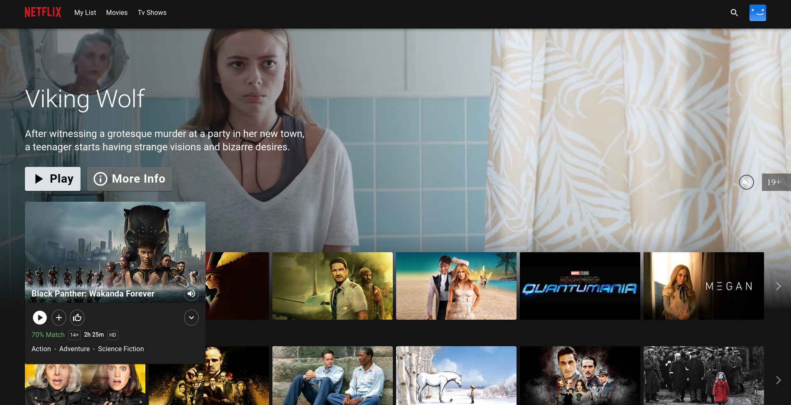

# "Creating and Securing Netflix Clone on GCP Using DevOps Tools (SonarQube, OWASP, Trivy, Jenkins, Docker, Kubernetes, Prometheus, Grafana)"

## This project aims to create a clone of the popular streaming platform Netflix and securely deploy it using modern DevOps practices. 

The project includes:

- A Netflix-like user interface developed using React and TypeScript.

- Using real movie and TV show data with TMDB API integration.

- Setting up a continuous integration and continuous delivery (CI/CD) pipeline with Jenkins.

- Conducting code quality and security analysis with SonarQube.

- Conducting security scans with OWASP and Trivy tools.

- Containerizing the application using Docker.

- Deploying the application on Google Cloud Platform (GCP).

- Monitoring application performance and infrastructure with Prometheus and Grafana.

This project aims to create a secure, scalable, and high-performance streaming platform clone by combining modern web development techniques, DevOps practices, and cloud technologies. At the same time, it provides a continuous improvement and security-focused development process using industry-standard tools.

<div align="center">
  <a href="http://netflix-clone-with-tmdb-using-react-mui.vercel.app/">
    
  </a>

  <h3 align="center">Netflix Clone</h3>

  <p align="center">
    <a href="https://netflix-clone-react-typescript.vercel.app/">View Demo</a>
    ·
    <a href="https://github.com/crazy-man22/netflix-clone-react-typescript/issues">Report Bug</a>
    ·
    <a href="https://github.com/crazy-man22/netflix-clone-react-typescript/issues">Request Feature</a>
  </p>
</div>

<details>
  <summary>Table of Contents</summary>
  <ol>
    <li>
      <a href="#prerequests">Prerequests</a>
    </li>
    <li>
      <a href="#which-features-this-project-deals-with">Which features this project deals with</a>
    </li>
    <li><a href="#third-party-libraries-used-except-for-react-and-rtk">Third Party libraries used except for React and RTK</a></li>
    <li>
      <a href="#contact">Contact</a>
    </li>
  </ol>
</details>

<br />

<div align="center">
  
  <p align="center">Home Page</p>
  
  <p align="center">Mini Portal</p>
  
  <p align="center">Detail Modal</p>
  
  <p align="center">Grid Genre Page</p>
  
  <p align="center">Watch Page with customer contol bar</p>
</div>

# Project stages:

## 1- Create VM instances in Gcloud (Ubuntu 22.04.4 LTS and 20 GB)
## 2- Set up firewall settings for the instance. Ports we'll need: 8080, 8081, 9000, 9090, 9100
## 3- On this server:
    1- Install Jenkins and ensure browser access
    2- Install Docker
    3- Create SonarQube Container `docker run -d --name sonar -p 9000:9000 sonarqube:lts-community`
    4- Install Trivy

## 4- Set up Monitoring Server, we'll create a new VM instance and use it as our monitoring server. (Ubuntu 22.04.4 LTS and 20 GB)

## 5- Install Prometheus on the Monitoring Server, for this:
    1- Create a system user named "prometheus"
  ```sh
  sudo useradd \
    --system \
    --no-create-home \
    --shell /bin/false prometheus
  ```  
    2- 
    - Download Prometheus file
```sh
wget https://github.com/prometheus/prometheus/releases/download/v2.51.2/prometheus-2.51.2.linux-amd64.tar.gz
```
  
    - Extract the tar file:
```sh 
tar -xvf prometheus-2.51.2.linux-amd64.tar.gz
```
   
    - Create directories for Prometheus data and configuration files
 ```sh
 sudo mkdir -p /data /etc/prometheus
```
    - Move Prometheus binaries to /usr/local/bin/ directory
```sh 
cd prometheus-2.51.2.linux-amd64/ 
sudo mv prometheus promtool /usr/local/bin/
```
    - Move console templates and libraries to /etc/prometheus/ directory
```sh
sudo mv consoles/ console_libraries/ /etc/prometheus/
```
    - Move Prometheus configuration file to /etc/prometheus/ directory
```sh
sudo mv prometheus.yml /etc/prometheus/prometheus.yml
```
    - Change ownership of Prometheus configuration and data directories to 'prometheus' user
```sh
sudo chown -R prometheus:prometheus /etc/prometheus/ /data/
```
    - Return to home directory
```sh
cd 
```
    - Remove downloaded Prometheus archive file
```sh
rm -rf prometheus-2.51.2.linux-amd64.tar.gz
```
    - Check Prometheus version
```sh
prometheus --version
```
    - View Prometheus help
```sh
prometheus --help
```
    3-
    Systemd configuration for Prometheus ensures that Prometheus runs as a service on Linux systems,
    allowing it to start automatically when the system restarts or when the service needs to be managed.

```sh
     sudo nano /etc/systemd/system/prometheus.service
```
```sh
    [Unit]
    Description=Prometheus
    Wants=network-online.target
    After=network-online.target

    StartLimitIntervalSec=500
    StartLimitBurst=5

    [Service]
    User=prometheus
    Group=prometheus
    Type=simple
    Restart=on-failure
    RestartSec=5s
    ExecStart=/usr/local/bin/prometheus \
        --config.file=/etc/prometheus/prometheus.yml \
        --storage.tsdb.path=/data \
        --web.console.templates=/etc/prometheus/consoles \
        --web.console.libraries=/etc/prometheus/console_libraries \
        --web.listen-address=0.0.0.0:9090 \
        --web.enable-lifecycle

    [Install]
    WantedBy=multi-user.target
```
```sh
    sudo systemctl enable prometheus 
    sudo systemctl start prometheus 
    sudo systemctl status prometheus
```

## 6- Install Node Exporter on the Monitoring Server, for this:
     1- Create a system user named "node_exporter"
```sh
sudo useradd \
--system \
--no-create-home \
--shell /bin/false node_exporter
```
     2- 
    - Download Node Exporter file
```sh
wget https://github.com/prometheus/node_exporter/releases/download/v1.8.0/node_exporter-1.8.0.linux-amd64.tar.gz
```  
    - Extract the tar file:
```sh
tar -xvf node_exporter-1.8.0.linux-amd64.tar.gz
```   
    - Move Node Exporter file to /usr/local/bin/ directory
```sh
sudo mv node_exporter-1.8.0.linux-amd64/node_exporter /usr/local/bin/
```
    - Remove downloaded Node Exporter archive file
```sh
rm -rf node_exporter*
```
    - Check Node Exporter version
```sh
node_exporter --version
```
    - View Node Exporter help
```sh
node_exporter --help
```

3-
Systemd configuration for Node Exporter ensures that Node Exporter runs as a service on Linux systems, allowing it to start automatically when the system restarts or when the service needs to be managed.

```sh
sudo nano /etc/systemd/system/node_exporter.service
```

```sh
    [Unit]
    Description=Node Exporter
    Wants=network-online.target
    After=network-online.target

    StartLimitIntervalSec=500
    StartLimitBurst=5

    [Service]
    User=node_exporter
    Group=node_exporter
    Type=simple
    Restart=on-failure
    RestartSec=5s
    ExecStart=/usr/local/bin/node_exporter \
        --collector.logind

    [Install]
    WantedBy=multi-user.target
```

```sh
sudo systemctl enable node_exporter
sudo systemctl start node_exporter
sudo systemctl status node_exporter
```

## 7- Creating Static Target for Prometheus
    
    1- Open the prometheus.yml configuration file.
```sh
sudo nano /etc/prometheus/prometheus.yml
```

    2- Paste this at the bottom of the prometheus.yml file:
```sh
    - job_name: node_export
      static_configs:
        - targets: ["localhost:9100"]
```

    3- To check:
```sh
promtool check config /etc/prometheus/prometheus.yml
curl -X POST http://localhost:9090/-/reload
```

## 8- Installing Node Exporter on Jenkins Server and Creating Static Target

    1- 
```sh
sudo useradd --system --no-create-home --shell /bin/false node_exporter
```

    2- Download the file
```sh
wget https://github.com/prometheus/node_exporter/releases/download/v1.8.0/node_exporter-1.8.0.linux-amd64.tar.gz 
```
    3- Extract the archive file
```sh
tar -xvf node_exporter-1.8.0.linux-amd64.tar.gz
```
    4- Move to the relevant location.
```sh
sudo mv node_exporter-1.8.0.linux-amd64/node_exporter /usr/local/bin/
```
    5- Delete unnecessary files
```sh
rm -rf node_exporter*
```
    6- Check the installation.
```sh
node_exporter --version
```
    7- Edit the service file.
```sh
sudo nano /etc/systemd/system/node_exporter.service
```
```sh
# node_exporter.service configurations file
        [Unit]
        Description=Node Exporter
        Wants=network-online.target
        After=network-online.target

        StartLimitIntervalSec=500
        StartLimitBurst=5

        [Service]
        User=node_exporter
        Group=node_exporter
        Type=simple
        Restart=on-failure
        RestartSec=5s
        ExecStart=/usr/local/bin/node_exporter \
            --collector.logind

        [Install]
        WantedBy=multi-user.target
```
```sh
# start and enable node_exporter
sudo systemctl enable node_exporter
sudo systemctl start node_exporter
sudo systemctl status node_exporter
```

## 9- Adding the Jenkins server as a target in the prometheus.yml configuration file on the monitoring server:

```sh
sudo nano /etc/prometheus/prometheus.yml
```

```sh
- job_name: node_export_jenkins
    static_configs:
      - targets: ["jenkins-server-publicIP:9100"]
```

To check:
```sh
promtool check config /etc/prometheus/prometheus.yml
curl -X POST http://localhost:9090/-/reload
```

## 10- Grafana Installation and Configuration on the Monitoring Server:

1- Install necessary packages for adding Grafana repository
```sh
sudo apt-get install -y apt-transport-https software-properties-common
```

2- Add Grafana GPG key to verify package integrity
```sh
wget -q -O - https://packages.grafana.com/gpg.key | sudo apt-key add -
```

3- Add Grafana repository to APT sources
```sh
echo "deb https://packages.grafana.com/oss/deb stable main" | sudo tee -a /etc/apt/sources.list.d/grafana.list
```

4- Update package lists to include Grafana packages
```sh
sudo apt-get update
```

5- Install Grafana
```sh
sudo apt-get -y install grafana
```

6- Enable Grafana service to start on boot
```sh
sudo systemctl enable grafana-server
```

7- Start Grafana service
```sh
sudo systemctl start grafana-server
```

8- Check status of Grafana service
```sh
sudo systemctl status grafana-server
```

9- After successful installation, access Grafana via the monitoring server's public IP on port 3000

10- Continue with the username and password as "admin" and set a new password.

11- Select Prometheus as "Data Sources". Add the monitoring server's public IP here.

12- Import a nice dashboard from the Dashboards section. I used "1860".


## 11- Installation and Integration of Prometheus Plugin to Jenkins:

1- Connect to Jenkins via jenkins_server_public_ip:8080

2- Go to "Manage Jenkins" → "Manage Plugins" → "Available Plugins".

3- In the search bar, type "prometheus". Download the first plugin that appears.

4- Restart Jenkins.

5- If you can see metrics in JSON format at http://Jenkins_server_public_ip:8080/prometheus, the endpoint is working. If not, check the plugin in Jenkins.
 

## 12- Add Jenkins to the prometheus.yml configuration file on the monitoring server

1- sudo nano /etc/prometheus/prometheus.yml

2-
```sh 
    - job_name: jenkins
      metrics_path: "/prometheus"
      static_configs:
        - targets: ["<jenkins-ip>:8080"]
```

3- To check:
```sh
promtool check config /etc/prometheus/prometheus.yml
curl -X POST http://localhost:9090/-/reload
```

## 13- Setting up Email Integration with Jenkins and Installing the Plugin

1- Here, we need to get an app password from our Gmail account to be able to send emails.
   Let's go to our Gmail account and generate the password.
   Two-factor authentication needs to be enabled for these operations.
   After doing this, go to "app passwords". Set a name like "jenkins" and click create.
   Save the generated password.

2- Enter Jenkins and go to Manage Jenkins > System > E-mail Notification.
   Let's fill in the following sections:

   SMTP server
    "smtp.gmail.com"
   Use SMTP Authentication?
    Username
    "mecit.tuksoy@gmail.com"
    Password
    "enter the password we saved"
   Check the "Use SSL" box
   SMTP Port?
    "465"
   You can send a test email by filling in the bottom section if you want.

3- We add our email and passwords as credentials for Jenkinsfile usage.

   Go to "Manage Jenkins" → "Credentials" and add your email username and the generated password.
   Kind
    "Username with password"
   Username
    "mecit.tuksoy@gmail.com"
   ID
    "mail"
   Create.

4- Manage Jenkins > System > Extended E-mail Notification

   SMTP server
    "smtp.gmail.com"
   SMTP Port
    "465"
   Credentials
    "mecit.tuksoy@gmail.com/****** (mail)"
    "Use SSL"
   Default Content Type
    "HTML (text/html)"
   Default Triggers
     "Always" and "failure- Any"
   Save

## 14- Creating Jenkins Job

1- Click "New Item", enter the name "Netflix", check "Pipeline" and click "OK".
   Click on "Pipeline" and paste the following post block into the "script" section and save.
````sh
    post {
        always {
            emailext attachLog: true,
                subject: "'${currentBuild.result}'",
                body: "Project: ${env.JOB_NAME}<br/>" +
                    "Build Number: ${env.BUILD_NUMBER}<br/>" +
                    "URL: ${env.BUILD_URL}<br/>",
                to: 'mecit.tuksoy@gmail.com@gmail.com',  #change Your mail
                attachmentsPattern: 'trivyfs.txt,trivyimage.txt'
            }
        }
````

## 15- Configuring Sonar Server in Manage Jenkins

1- Let's access the Sonarqube we installed with Container from the browser with "public_ip:9000"

2- Go to Administration > security > Users > Update Token, give it a name like "jenkins", select a day and click "Generate".

3- To save the generated token in Jenkins:
   Go to "Manage Jenkins → Credentials → System → Global Credentials → Add Credentials → Secret Text"
   Paste the token in the "Secret" field
   Give a name like "Sonar-token" in the "ID" field. Click "Create".

4- To install the "SonarQube Scanner" plugin in Jenkins:
   Go to "Manage Jenkins → Plugins → Available plugins → search for "SonarQube Scanner" and install the plugin.

5- "Manage Jenkins → System → SonarQube server → Add SonarQube "
   "Name" = sonar-server
   "Server URL" = SonarQube-public-ip:9000
   "Server authentication token" = Sonar-token
   Save

6- "Manage Jenkins → Tool → SonarQube Scanner installations → 
   "Name" = sonar-scanner
   "Version" = 5.0.1.3006
   Save

7- Go to SonarQube in your browser
   Administration > Configuration > Webhooks > Create >
   "Name" = jenkins
   "URL" = http://jenkins-server-ip:8080/sonarqube-webhook/
   Create

Before running the pipeline, we need to check our Node and JVM versions. We should configure these as required by the Jenkinsfile.

In this pipeline, the statement "jdk 'jdk17'" indicates that JDK 17 is installed on the Jenkins server and the pipeline will use this JDK version. Similarly, the statement "nodejs 'node16'" indicates that Node.js version 16 is installed on the Jenkins server and the pipeline will use this version.

>>> Let's install the "NodeJS" plugin from the available plugins section in Jenkins

>>> Let's add "NodeJS 16.20.2" from the tools section in Jenkins

>>> Let's add "JDK" from the tools section in Jenkins. Let's give this path on the jenkins server to the JAVA_HOME variable "/usr/lib/jvm/java-17-openjdk-amd64" and save it.


## 16- Creating a Jenkins Pipeline

>>> Select the "Netfilix" pipeline and click "Configure." Paste the following pipeline:
````sh
pipeline{
    agent any
    tools{
        jdk 'jdk17'
        nodejs 'node16'
    }
    environment {
        SCANNER_HOME=tool 'sonar-scanner'
    }
    stages {
        stage('clean workspace'){
            steps{
                cleanWs()
            }
        }
        stage('Checkout from Git'){
            steps{
                git branch: 'main', url: 'https://github.com/Mecit-tuksoy/Devops-Security-Projects.git'
            }
        }
        stage("Sonarqube Analysis "){
            steps{
                withSonarQubeEnv('sonar-server') {
                    sh ''' $SCANNER_HOME/bin/sonar-scanner -Dsonar.projectName=Netflix \
                    -Dsonar.projectKey=Netflix '''
                }
            }
        }
        stage("quality gate"){
           steps {
                script {
                    waitForQualityGate abortPipeline: false, credentialsId: 'Sonar-token' 
                }
            } 
        }
        stage('Install Dependencies') {
            steps {
                sh "npm install"
            }
        }
    }
    post {
     always {
        emailext attachLog: true,
            subject: "'${currentBuild.result}'",
            body: "Project: ${env.JOB_NAME}<br/>" +
                "Build Number: ${env.BUILD_NUMBER}<br/>" +
                "URL: ${env.BUILD_URL}<br/>",
            to: 'mecit.tuksoy@gmail.com',
            attachmentsPattern: 'trivyfs.txt,trivyimage.txt'
        }
    }
}
````

>>> This pipeline fetches the code from a GitHub repository for a Java project, installs dependencies, performs a SonarQube analysis, and checks the SonarQube quality gate. It decides whether to continue the pipeline based on whether the quality gate criteria are met and finally sends an email notification.

>>> Click "Build Now" to run the pipeline. A success message will be sent to your email.


## 17- Install OWASP Dependency Check Plugins

1- Manage Jenkins → Plugins → Available Plugins → Install "OWASP Dependency Check."

2- Manage Jenkins → Global Tool Configuration → Dependency-Check Installations → Add Dependency-Check.

"Name" = DP-Check

"Install automatically" = Install from github.com

"Version" = Select the latest version

Save.

>>> Go to the pipeline configuration and add the following step:

````sh
stage('OWASP FS SCAN') {
    steps {
        dependencyCheck additionalArguments: '--scan ./ --disableYarnAudit --disableNodeAudit', odcInstallation: 'DP-Check'
        dependencyCheckPublisher pattern: '**/dependency-check-report.xml'
    }
}
stage('TRIVY FS SCAN') {
    steps {
        sh "trivy fs . > trivyfs.txt"
    }
}
````

These two stages perform security scans for the project, identifying vulnerabilities at both the dependency level (OWASP Dependency-Check) and the file system level (Trivy). The resulting reports can be evaluated later in the pipeline or stored for review.


#!/bin/bash

## 18- Building, Pushing, and Deploying Docker Images

  1- Before starting this step, we need to obtain an API key for our application to work.
  Let's register at https://www.themoviedb.org/ and create an API key.

  2- Settings > API > Create > Developer > Accept > Fill in the required fields and obtain your API key.

  3- Switch to the Jenkins user and manually test the application:

````sh 
sudo su - jenkins 
cd /workspace/Netflix/ 
ls 
cat Dockerfile
````
````sh
docker build --build-arg TMDB_V3_API_KEY=<insert_your_API_key_here> -t netflix-clone .
````
````sh
docker run --name netflix-clone-website --rm -d -p 8081:80 netflix-clone
````
>>> Access the application at public-ip:8081 to verify it's running successfully.

  4- Once we've confirmed that the application is running successfully, we can delete the image and container.
````sh
docker rm -f netflix-clone-website 
docker rmi netflix-clone
````


## 19- Continue with Jenkins settings:

  1- Manage Jenkins > Plugins > Available Plugins: Let's install the following plugins.
     - Docker
     - Docker Commons
     - Docker Pipeline
     - Docker API
     - docker-build-step

  2- Manage Jenkins > Global Tool Configuration > Docker Installations:

     - Name: docker
     - Install automatically
     - Download from docker.com
     - Docker version: latest
     - Save

  3- Manage Jenkins > Credentials > System > Global credentials (unrestricted):
     - Kind: Username with password
     - Username: Enter your Docker Hub username
     - Password: Enter your Docker Hub token
     - ID: Provide a name like "docker," which we'll use in the pipeline
     - Create

  4- In Jenkins, paste the following code into the Netfilix pipeline:

````sh
pipeline {
    agent any
    tools {
        jdk 'jdk17'
        nodejs 'node16'
    }
    environment {
        SCANNER_HOME = tool 'sonar-scanner'
    }
    stages {
        stage('clean workspace') {
            steps {
                cleanWs()
            }
        }
        stage('Checkout from Git') {
            steps {
                git branch: 'main', url: 'https://github.com/Mecit-tuksoy/Devops-Security-Projects.git'
            }
        }
        stage("Sonarqube Analysis ") {
            steps {
                withSonarQubeEnv('sonar-server') {
                    sh ''' $SCANNER_HOME/bin/sonar-scanner -Dsonar.projectName=Netflix \
                    -Dsonar.projectKey=Netflix '''
                }
            }
        }
        stage("quality gate") {
            steps {
                script {
                    waitForQualityGate abortPipeline: false, credentialsId: 'Sonar-token' 
                }
            }
        }
        stage('Install Dependencies') {
            steps {
                sh "npm install"
            }
        }
        // stage('OWASP FS SCAN') {
        //     steps {
        //         dependencyCheck additionalArguments: '--scan ./ --disableYarnAudit --disableNodeAudit', odcInstallation: 'DP-Check'
        //         dependencyCheckPublisher pattern: '**/dependency-check-report.xml'
        //     }
        // }
        stage('TRIVY FS SCAN') {
            steps {
                sh "trivy fs . > trivyfs.txt"
            }
        }
        stage("Docker Build & Push") {
            steps {
                script {
                    withDockerRegistry(credentialsId: 'docker', toolName: 'docker') {   
                        sh "docker build --build-arg TMDB_V3_API_KEY=<write_your_TMDB_api_key> -t netflix ."
                        sh "docker tag netflix mecit35/netflix:latest "
                        sh "docker push mecit35/netflix:latest "
                    }
                }
            }
        }
        stage('Deploy to container') {
            steps {
                sh 'docker rm -f netflix || true'
                sh 'docker run -d --name netflix -p 8081:80 mecit35/netflix:latest'
            }
        }
        stage('Check Application Status') {
            steps {
                script {
                    def response = sh(script: "curl -s -o /dev/null -w \"%{http_code}\" http://jenkins-server-public-ip:8081", returnStdout: true).trim()
                    if (response == '200') {
                        echo "Application is running successfully."
                    } else {
                        error "Application is not running. HTTP response code: ${response}"
                    }
                }
            }
        }
        stage("TRIVY") {
            steps {
                sh "trivy image mecit35/netflix:latest > trivyimage.txt" 
            }
        }
    }
    post {
        always {
            emailext attachLog: true,
                subject: "'${currentBuild.result}'",
                body: "Project: ${env.JOB_NAME}<br/>" +
                    "Build Number: ${env.BUILD_NUMBER}<br/>" +
                    "URL: ${env.BUILD_URL}<br/>",
                to: 'mecit.tuksoy@gmail.com',
                attachmentsPattern: 'trivyfs.txt,trivyimage.txt'
        }
    }
}
````

This pipeline includes building a Docker image, tagging it, pushing it to Docker Hub, running it in a container, checking the application's status, and performing a Trivy scan on the Docker image. 
The OWASP Dependency-Check scan and report generation step has been commented out as it was demonstrated in the previous pipeline and can take a long time.


## 20- Kubernetes Setup

1- Create two Ubuntu 20.04 LTS images and e2-medium type virtual machines. One as the master and the other as the worker.

2- Log into the master machine and create a "master.sh" file with the following script. Set the permissions and run it.

````sh
sudo nano master.sh
````
````sh
#!/bin/bash
# APT update
sudo apt update

# Installation of Kubectl
curl -LO "https://dl.k8s.io/release/$(curl -L -s https://dl.k8s.io/release/stable.txt)/bin/linux/amd64/kubectl"
sudo install -o root -g root -m 0755 kubectl /usr/local/bin/kubectl

# Installation and configuration of Docker
sudo apt-get update
sudo apt-get install -y docker.io
sudo usermod -aG docker $USER
grep '^docker:' /etc/group; getent group docker
sudo chmod 777 /var/run/docker.sock

# System update and installation of necessary packages
sudo apt-get update -y
sudo apt-get upgrade -y
sudo apt-get install -y apt-transport-https ca-certificates curl gpg
sudo mkdir -p /etc/apt/keyrings/
curl -fsSL https://pkgs.k8s.io/core:/stable:/v1.29/deb/Release.key | sudo gpg --dearmor -o /etc/apt/keyrings/kubernetes-apt-keyring.gpg
echo 'deb [signed-by=/etc/apt/keyrings/kubernetes-apt-keyring.gpg] https://pkgs.k8s.io/core:/stable:/v1.29/deb/ /' | sudo tee /etc/apt/sources.list.d/kubernetes.list

# Installation of Kubernetes
sudo apt-get update
sudo apt-get install -y kubelet=1.29.0-1.1 kubeadm=1.29.0-1.1 kubernetes-cni
sudo apt-mark hold kubelet kubeadm kubectl

# Starting and enabling Docker service
sudo systemctl start docker
sudo systemctl enable docker

# Loading kernel modules and sysctl configuration
sudo tee /etc/modules-load.d/k8s.conf <<EOF
overlay
br_netfilter
EOF

sudo modprobe overlay
sudo modprobe br_netfilter

sudo tee /etc/sysctl.d/k8s.conf <<EOF
net.bridge.bridge-nf-call-iptables  = 1
net.bridge.bridge-nf-call-ip6tables = 1
net.ipv4.ip_forward                 = 1
EOF

sudo sysctl --system

# Installation and configuration of Containerd
sudo apt update
sudo apt install -y containerd
sudo systemctl start containerd
sudo systemctl enable containerd
sudo mkdir -p /etc/containerd
sudo containerd config default | sudo tee /etc/containerd/config.toml >/dev/null 2>&1
sudo sed -i 's/SystemdCgroup = false/SystemdCgroup = true/g' /etc/containerd/config.toml
sudo systemctl restart containerd

# Checking the status of Containerd
echo "Installation completed!"
````
This script includes all the steps required for Kubernetes and Docker installation and ensures that the system is ready to run Kubernetes cluster. Also, necessary kernel settings are made and containerd container runtime is configured.

````sh
sudo chmod +x master.sh 
bash master.sh
````

3- Install the essential components for the Kubernetes cluster on the master machine.
````sh
sudo nano kubernetes.sh
````

````sh
#!/bin/bash

set -e  # Exit immediately if a command exits with a non-zero status.

# Pull Kubernetes images
sudo kubeadm config images pull

# Initialize Kubernetes cluster
sudo kubeadm init --pod-network-cidr=10.244.0.0/16 --ignore-preflight-errors=All

# Set up kubeconfig for the user
USER_HOME=$(eval echo ~$USER)
sudo mkdir -p $USER_HOME/.kube
sudo cp -i /etc/kubernetes/admin.conf $USER_HOME/.kube/config
sudo chown $USER:$USER $USER_HOME/.kube/config

# Apply Flannel pod network
sudo -i -u $USER kubectl apply -f https://github.com/coreos/flannel/raw/master/Documentation/kube-flannel.yml

# Apply Local Path Provisioner
sudo -i -u $USER kubectl apply -f https://raw.githubusercontent.com/rancher/local-path-provisioner/v0.0.26/deploy/local-path-storage.yaml

# Set Local Path StorageClass as default
sudo -i -u $USER kubectl patch storageclass local-path -p '{"metadata": {"annotations":{"storageclass.kubernetes.io/is-default-class":"true"}}}'

echo "Kubernetes cluster setup complete!"
````
This script sets the Flannel network plugin and the local storage class (Local Path Provisioner) so that the cluster is fully operational.

Set permissions and execute the script
````sh
sudo chmod +x kubernetes.sh 
bash kubernetes.sh 
kubectl get no
````
4- Now, connect to the worker node and continue the installation. Follow similar steps to the master node for setting up the necessary components.
````sh
sudo nano worker.sh
````
````sh
#!/bin/bash
# APT update
sudo apt update

# Installation of Kubectl
curl -LO "https://dl.k8s.io/release/$(curl -L -s https://dl.k8s.io/release/stable.txt)/bin/linux/amd64/kubectl"
sudo install -o root -g root -m 0755 kubectl /usr/local/bin/kubectl

# Installation and configuration of Docker
sudo apt-get update
sudo apt-get install -y docker.io
sudo usermod -aG docker $USER
grep '^docker:' /etc/group; getent group docker
sudo chmod 777 /var/run/docker.sock

# System update and installation of necessary packages
sudo apt-get update -y
sudo apt-get upgrade -y
sudo apt-get install -y apt-transport-https ca-certificates curl gpg
sudo mkdir -p /etc/apt/keyrings/
curl -fsSL https://pkgs.k8s.io/core:/stable:/v1.29/deb/Release.key | sudo gpg --dearmor -o /etc/apt/keyrings/kubernetes-apt-keyring.gpg
echo 'deb [signed-by=/etc/apt/keyrings/kubernetes-apt-keyring.gpg] https://pkgs.k8s.io/core:/stable:/v1.29/deb/ /' | sudo tee /etc/apt/sources.list.d/kubernetes.list

# Installation of Kubernetes
sudo apt-get update
sudo apt-get install -y kubelet=1.29.0-1.1 kubeadm=1.29.0-1.1 kubernetes-cni
sudo apt-mark hold kubelet kubeadm kubectl

# Starting and enabling Docker service
sudo systemctl start docker
sudo systemctl enable docker

# Loading kernel modules and sysctl configuration
sudo tee /etc/modules-load.d/k8s.conf <<EOF
overlay
br_netfilter
EOF

sudo modprobe overlay
sudo modprobe br_netfilter

sudo tee /etc/sysctl.d/k8s.conf <<EOF
net.bridge.bridge-nf-call-iptables  = 1
net.bridge.bridge-nf-call-ip6tables = 1
net.ipv4.ip_forward                 = 1
EOF

sudo sysctl --system

# Installation and configuration of Containerd
sudo apt update
sudo apt install -y containerd
sudo systemctl start containerd
sudo systemctl enable containerd
sudo mkdir -p /etc/containerd
sudo containerd config default | sudo tee /etc/containerd/config.toml >/dev/null 2>&1
sudo sed -i 's/SystemdCgroup = false/SystemdCgroup = true/g' /etc/containerd/config.toml
sudo systemctl restart containerd

# Checking the status of Containerd
echo "Installation completed!"
````

Set permissions and execute the script
````sh
sudo chmod +x worker.sh 
./worker.sh
````

5- Join the Kubernetes worker node to the master. If you create additional worker nodes, you can connect them to the master in this way. Run the following command on the master node to get the join command:

````sh
sudo kubeadm token create --print-join-command
````
Copy the output and paste it into the worker node terminal, like this:

````sh
sudo kubeadm join 10.182.0.5:6443 --token u4rdkh.hz16x9z9lqy5ysrg --discovery-token-ca-cert-hash sha256:dd41f62822bc8b897d4a843eb4be1daf4426570318f9a28c827d88fcb4d7738b
````
>>> Finally, check if the worker node is connected by running the following command on the master node:
````sh kubectl get no````

## 21- Install Node Exporter on both master and worker nodes to monitor metrics 
````sh
sudo useradd \
--system \
--no-create-home \
--shell /bin/false node_exporter
````
````sh
wget https://github.com/prometheus/node_exporter/releases/download/v1.8.0/node_exporter-1.8.0.linux-amd64.tar.gz 
tar -xvf node_exporter-1.8.0.linux-amd64.tar.gz 
sudo mv node_exporter-1.8.0.linux-amd64/node_exporter /usr/local/bin/
rm -rf node_exporter* 
node_exporter --version
````
````sh
sudo nano /etc/systemd/system/node_exporter.service
````
````sh
[Unit]
Description=Node Exporter
Wants=network-online.target
After=network-online.target

StartLimitIntervalSec=500
StartLimitBurst=5

[Service]
User=node_exporter
Group=node_exporter
Type=simple
Restart=on-failure
RestartSec=5s
ExecStart=/usr/local/bin/node_exporter \
    --collector.logind

[Install]
WantedBy=multi-user.target
````
````sh
sudo systemctl enable node_exporter
sudo systemctl start node_exporter
sudo systemctl status node_exporter
````
>>> Connect to the monitoring server and add configuration to the prometheus.yml file
````sh
sudo nano /etc/prometheus/prometheus.yml 
````
Add the following configurations:
````sh
- job_name: master
    static_configs:
      - targets: ["master_public_ip:9100"]

- job_name: worker
    static_configs:
      - targets: ["worker_public_ip:9100"]
````
````sh
promtool check config /etc/prometheus/prometheus.yml
curl -X POST http://localhost:9090/-/reload
````

## 22- Install kubectl on the Jenkins server:

1- At this stage, we need to establish a connection between Jenkins and our Kubernetes cluster.
We need to install kubectl on the Jenkins server so that Jenkins can manage the Kubernetes cluster.
````sh
sudo nano kube.sh
````
````sh
sudo apt update
sudo apt install curl -y
curl -LO https://dl.k8s.io/release/$(curl -L -s https://dl.k8s.io/release/stable.txt)/bin/linux/amd64/kubectl
sudo install -o root -g root -m 0755 kubectl /usr/local/bin/kubectl
kubectl version --client
````
````sh
sudo chmod +x kube.sh 
bash kube.sh
````

2- On the master node, save the "config" file under the /home/.kube directory somewhere. I named it "secret-file.txt".
We will use this file in the Kubernetes credentials section.

3- In Jenkins, download and install the Kubernetes plugins to manage Kubernetes.
To do this:

Go to Manage Jenkins > Manage Plugins > Available Plugins and add the following plugins:

  - Kubernetes Credential
  - Kubernetes Client API
  - Kubernetes
  - Kubernetes CLI

4- Add Kubernetes credentials:

"Manage Jenkins" → “Manage Credentials” → Click on “Jenkins” global → “Add Credentials”.

  - "Kind" = Secret file 
  - "File" = select the secret-file.txt file.
  - "ID" = k8s
  - create

5- Kubernetes manifest yaml files will be as follows:

>>> deployment.yml
````sh
apiVersion: apps/v1
kind: Deployment
metadata:
  name: netflix-app
  labels:
    app: netflix-app
spec:
  replicas: 2
  selector:
    matchLabels:
      app: netflix-app
  template:
    metadata:
      labels:
        app: netflix-app
    spec:
      containers:
      - name: netflix-app
        image: mecit35/netflix:latest
        ports:
        - containerPort: 80
````

>>> service.yml
````sh
apiVersion: v1
kind: Service
metadata:
  name: netflix-app
  labels:
    app: netflix-app
spec:
  type: NodePort
  ports:
  - port: 80
    targetPort: 80
    nodePort: 30007
  selector:
    app: netflix-app
````

6- Add the following step to the "Netfilix" pipeline to deploy it to the Kubernetes cluster.
````sh
stage('Deploy to kubernets'){
    steps{
        script{
            dir('Kubernetes') {
                withKubeConfig(caCertificate: '', clusterName: '', contextName: '', credentialsId: 'k8s', namespace: '', restrictKubeConfigAccess: false, serverUrl: '') {
                        sh 'kubectl apply -f deployment.yml'
                        sh 'kubectl apply -f service.yml'
                }   
            }
        }
    }
}
````
 This phase deploys resources to the Kubernetes cluster as part of the Jenkins pipeline. It traverses to the Kubernetes directory where the deployment.yml and service.yml files are located, connects to the specified cluster, and applies (creates or updates) the Kubernetes resources specified by these files. This process allows the application to run in the Kubernetes environment.
